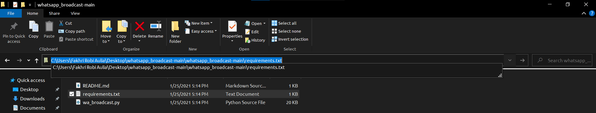
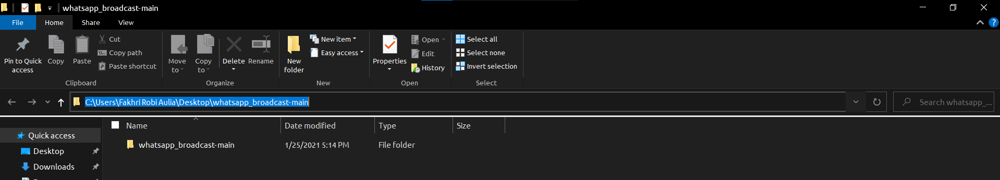

Multi Purpose Whatsapp Broadcast: 

Are You  tired sending the messages all over time to your clients ? dont worry, i hope this bot could reduce broadcasting time and doing something more worthy jobs.

##Step  by Step  Installation  : 
1. Clone this repository or download zip file of this project by clicking download code  button and choose *Download ZIP*.
```
git clone https://github.com/fakhrirobi/whatsapp_broadcast.git 
```
    

2. Extract the folder whatsapp_broadcast.
   
3. Open up folder python installer, *if your pc is 32 bit : run python-3.8.5.exe if 64 bit run python-3.8.5-amd64.exe*, and then follow the python installation instruction.

4. After python installed, Then Click Windows Button + R to run Command Prompt (CMD) and paste this code  
   ```python
   python get-pip.py
   ````
   

5. Go to whatsapp_broadcast folder again, you will find requirements.txt file.


6.  Copy the path of requirements.txt file 

 

8. Go to cmd by clicking WIndows button + R and enter this code
```cmd
    cd /d path to requirements.txt

    example :
    cd /d C:\Users\Fakhri Robi Aulia\Desktop\whatsapp_broadcast-main\whatsapp_broadcast-main
```
9. Install all packages in requirements.txt by  copying and pasting this following code
```python
pip install -r requirements.txt
```


 9. Wait for the installation to finish.


## Usage Documenation :

1. Click Windows Button + R to open up Command Prompt (CMD).
2. Copy and Paste this code :
   ```
   cd /d path to whatsapp_broadcast folder 
   ```
   example : 
   ```
   cd /d C:\Users\Fakhri Robi Aulia\Desktop\whatsapp_broadcast-main
   ```
   
   


3. Create an Excel file (.xlsx) that contains "RECIPIENT" column, and save it somewhere else, for example : 
   
   
4. To Run The Application ,copy  and paste this following code :
   ```python 
   python main.py
   ```
5. The Application Interface will appear : 
   
6. 
      A. Click Broadcast Message Only if you want to Broadcast Message Only, the steps :
         1.  Input the Messages you want to Broadcast 
            
         2.  Click Choose Recipient List File, and FileExplorer Dialog Will Appear
            
         3.  Click Save All Records
            
         4.  Click Save All Run Broadcast
            

   
      B. If You Want to Add Attachment just Click         Broadcast Message with Attachments : 
         1.  Input the Messages you want to Broadcast 
            
         2. Click Please Choose Attachment File and FileExplorer Dialog Will Appear
            
         3.  Click Choose Recipient List File, and FileExplorer Dialog Will Appear
            
         4.  Click Save All Records
         5.  Click Save All Run Broadcast
            
         6. 

7. 